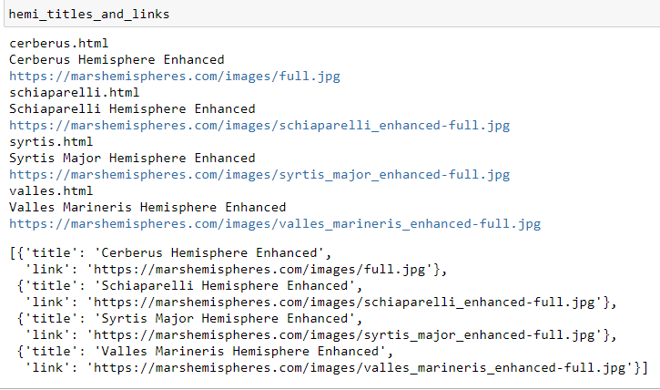

# **Web-Scraping-Cchallenge - Mission to Mars**

## **Step 1 - Scraping**:
---

A thorough initial scraping is done from various websites for data related to the 'Mission to Mars', using the  Jupyter Notebook, BeautifulSoup, Pandas, and Requests/Splinter.

- Below are the links of the websites used to scrape the data:

- NASA Mars News site: https://redplanetscience.com/     
- Featured Space Image site: https://spaceimages-mars.com/
- Mars Facts webpage: https://galaxyfacts-mars.com/
- Astrogeology site: https://marshemispheres.com/

## **NASA Mars News**:
---

-Here the latest NASA Mars news is collected and assigned to the variables for reference. Below is the screenshot of the output image.

## **JPL Mars Space Images - Featured Image**:
---

- Here Splinter is used to navigate the site to find the image url for the current Featured Mars Image and assign the url string to a variable. Below is the screenshot of the output image.

## **Mars Facts**:
---

- Here Pandas is used to scrape the table containing facts about the planet including Diameter, Mass, etc., and converted the data to HTML table string. Below is the screenshot of the output image.

## **Mars Hemispheres**:
---

- Here a high resolution images for each of Mar's hemispheres is gathered from astrogeology site. Below is the screenshot of the output image.

## **Step 2 - MongoDb and Flask Application**:
---

- MongoDB with Flask templating is used to create a new HTML page that displays all of the information that was scraped from the URLs above.

- Python dictionary is containing all of the scraped data.

- Stored the return value in Mongo as a Python dictionary.

- A root route / -- queried the Mongo database and passed the mars data into an HTML template to display the data.

- A template HTML file called index.html takes the mars data dictionary and display all of the data in the appropriate HTML elements.

